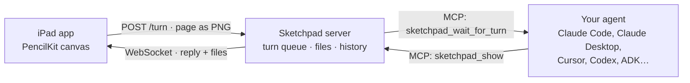
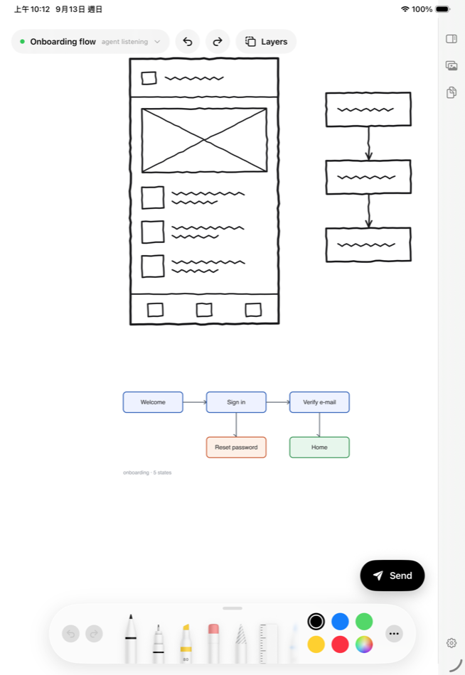

# Sketchpad

**Draw on an iPad. Your coding agent sees the page, answers, and draws back.**

Typing is a bad way to describe a layout, a flow, or a shape. Sketchpad turns an iPad into a
handwriting pad for whatever agent you already use: you sketch with an Apple Pencil and press Send,
the agent receives the page as an image, and it replies in your own medium — a few pen strokes on
top of your drawing, or a rendered diagram dropped in as a layer you can draw over and send back.

The agent keeps its own session, its own memory, its own tools. The iPad is only a surface.


This is a side project. It works, it is used daily by exactly one person, and it is not a company
product.

---

## How it works



One process holds everything: the queue of pages you have sent, the replies, and the files the
agent hands over. Agents reach it as an ordinary MCP server, so nothing here is tied to a
particular vendor.

The agent **pulls**: it sits in `sketchpad_wait_for_turn` until you send a page. MCP has no way for
a server to push a message into an agent's conversation, and the 2026-07-28 revision removed
server-initiated requests altogether, so long-polling is the honest answer rather than a
workaround. The iPad, in the other direction, is pushed to over a WebSocket.

### Two kinds of reply

Nothing the agent sends touches your canvas on its own. Replies queue as cards in the corner; you
place them or dismiss them.

- **Strokes.** The agent returns stroke-only SVG in the coordinate space of the image it just saw.
  Sketchpad converts it into real PencilKit strokes, placed over your drawing, drawn in one at a
  time. Erase them, lasso them, draw over them. The next page you send shows its strokes in grey
  and yours in black, so it can tell what you changed.
- **Layers.** A rendered Mermaid or draw.io diagram, or a generated image, arrives as a movable
  layer underneath your strokes. Long-press to grab it, drag to move, pinch to resize, lock it and
  trace over it.



---

## Setup

### 1. Start the server

```bash
git clone https://github.com/ryanlai/sketchpad.git
cd sketchpad && npm install && npm start
```

It prints a pairing QR code and listens on port 8791.

### 2. Connect your agent

```bash
npm run register            # show what would change
npm run register -- --write # apply it
```

This finds the MCP clients installed on the machine — Claude Code, Claude Desktop, Cursor,
Windsurf, VS Code — and writes each one's config, merged and backed up. Nothing to type, no paths.

<details>
<summary>Other ways in</summary>

**As a Claude Code plugin** (brings the `/sketchpad` skill with it):

```bash
claude plugin marketplace add /path/to/sketchpad
claude plugin install sketchpad@sketchpad --scope user
```

**As a one-click bundle for Claude Desktop:**

```bash
npm run bundle   # writes dist/sketchpad.mcpb — drag it into Claude Desktop's settings
```

**By hand.** `server/mcp-stdio.mjs` is a stdio MCP server that finds the shared Sketchpad process,
starts it if nobody has, and proxies to it. Several clients can run it at once and all see the same
iPad.

```bash
npm link                                                # so the name resolves
claude mcp add --scope user sketchpad -- sketchpad-mcp
```

```json
{ "mcpServers": { "sketchpad": { "command": "sketchpad-mcp" } } }
```

Claude Desktop starts with a bare `PATH`, so give it an absolute path there, or use the bundle.

**Over HTTP**, for an agent that is already running or lives on another machine:

```bash
claude mcp add --scope user --transport http sketchpad http://localhost:8791/mcp
```

</details>

### 3. Install the iPad app

`ios/` is a SwiftUI + PencilKit app. There is no App Store build; you sign it yourself.

```bash
brew install xcodegen
cd ios && xcodegen generate && open Sketchpad.xcodeproj
```

Set your own team under **Signing & Capabilities**, plug in the iPad, and Run. A free Apple ID
works and needs re-signing every seven days.

The app finds the computer by itself over Bonjour. On a network that blocks it (guest Wi-Fi,
separate VLANs) tap **Scan the QR code** and point the camera at the terminal.

### 4. Draw

Open a session with your agent and say `/sketchpad`, or just "listen to the iPad". It will wait for
your first page.

---

## MCP tools

| Tool | What it does |
| --- | --- |
| `sketchpad_wait_for_turn` | Block until a page is sent. Returns the note and the page as an image. Grey strokes are ones the agent has already seen. |
| `sketchpad_show` | Reply. `svg` becomes editable strokes on the canvas; `image_path` becomes a layer; `text` alone is just a message. |
| `sketchpad_get_canvas` | Snapshot the canvas right now, without waiting. |
| `sketchpad_list_turns` | Every page sent on this sheet, with what the agent replied. |
| `sketchpad_get_turn` | One earlier page and its image, to compare versions. |
| `sketchpad_set_title` | Name the current sheet from what is drawn on it. |
| `sketchpad_status` | Whether an iPad is connected and how many pages are queued. |

The loop the agent should run is in [`.claude/skills/sketchpad/SKILL.md`](.claude/skills/sketchpad/SKILL.md).
Copy it to `~/.claude/skills/` to have it everywhere, or install the plugin, which carries it.

---

## In the app

| | |
| --- | --- |
| **Sheets** | Many pages, auto-saved, named by you or by the agent. |
| **Turns** | Every send is kept with its full strokes, so you can reopen one, export it, branch it into a new sheet, or remove just the strokes the agent added that turn. |
| **Media** | Every image on this sheet, yours and the agent's, to share or place. |
| **Layer mode** | Long-press any layer to grab it; drag, pinch, lock, reorder. |
| **While drawing** | The floating controls fade. The rail stays: things that slide off-screen strand you. |

Settings are four items on purpose: which computer, an optional token, paper style, and whether a
finger draws. Everything else is a behaviour, not a choice.

---

## Configuration

| Variable | Default | |
| --- | --- | --- |
| `SKETCHPAD_PORT` | `8791` | The port everything uses. Your registered MCP URL carries it, so the server refuses to move it silently. |
| `SKETCHPAD_TOKEN` | none | Shared secret; the pairing QR carries it to the iPad. |
| `SKETCHPAD_HOST` | LAN IP | What to advertise, if detection picks the wrong interface. |
| `SKETCHPAD_NO_BONJOUR` | | Skip advertising. |
| `SKETCHPAD_URL` | `http://127.0.0.1:8791` | Where the stdio wrapper looks for the shared server. |
| `SKETCHPAD_NO_AUTOSTART` | | Stop the wrapper starting a server. |

---

## Development

```
server/
  index.mjs         HTTP + WebSocket + /mcp, Bonjour, pairing QR
  sketchpad.mjs     the MCP tools, the turn queue, the reply history
  mcp-stdio.mjs     stdio entry point; finds or starts the shared server
  plugin-entry.mjs  the same, with a dependency install for plugin installs
ios/                SwiftUI + PencilKit app (XcodeGen project)
scripts/register.mjs  writes MCP client configs
docs/               screenshots
```

```bash
npm test            # MCP contract over HTTP, and the stdio wrapper
```

Pages you send land in `inbox/` with a `turns.json` manifest; files the agent hands over land in
`outbox/`. Both are plain files you can read.

---

## Known limits

- **The agent looks busy.** `wait_for_turn` blocks, so that session shows as running a tool while it
  waits. It costs almost nothing in tokens, but you cannot type into that session meanwhile. Treat
  it as a mode you enter and leave.
- **Same network only.** No relay. Something like Tailscale would fix it and has not been wired up.
- **No App Store build**, so seven-day re-signing with a free Apple ID.
- **Mermaid and draw.io are not rendered here.** The agent renders them and hands over an image, so
  it needs its own way to produce one.
- **iPad only.** Nothing about the server is, but the client is.

## License

MIT
