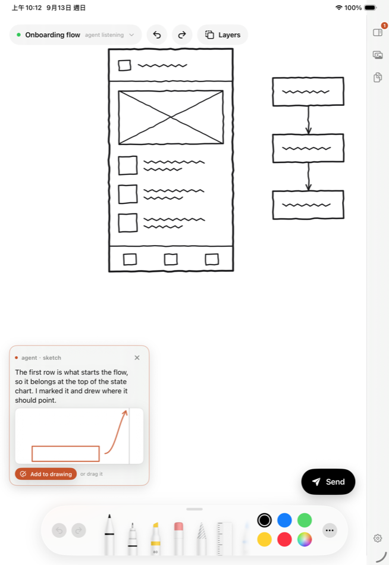

<p align="center">
  
</p>

<h1 align="center">Sketchpad</h1>

<p align="center">
  <b>Draw on an iPad. Your coding agent sees the page, answers, and draws back.</b>
</p>

<p align="center">
  
  
  
  
  
</p>

<p align="center">
  
</p>

Some things are faster to draw than to describe. Sketch a layout, press Send, and your agent gets the
page as an image. It answers in kind: a few pen strokes on your drawing, or a diagram dropped in as a
layer you can draw over and send back.

Sketchpad is an MCP server, so your agent keeps its own session, memory and tools.

**You will need** an iPad with an Apple Pencil, and a Mac with Xcode. There is no App Store build
yet, so you sign the app yourself.

---

## Setup

**1. Start the server.** It listens on port 8791 and prints a pairing code.

```bash
git clone https://github.com/yenlianglai/sketchpad.git
cd sketchpad && npm install && npm start
```

**2. Connect your agent.** This finds the MCP clients on your machine, writes each one's config —
merged and backed up — and sets the server to start when you log in. No paths to type.

```bash
npm run setup
```

<details>
<summary>Other ways in, and the rest of the commands</summary>

| Client | |
| --- | --- |
| Claude Code | `claude plugin marketplace add .` then `claude plugin install sketchpad@sketchpad` — brings the `/sketchpad` skill with it |
| Claude Desktop | `npm run bundle`, then drag `dist/sketchpad.mcpb` into Settings |
| Cursor · Windsurf · VS Code | `{ "command": "sketchpad-mcp" }` after `npm link` |
| Anything else with MCP | stdio: `sketchpad-mcp` · or HTTP: `https://localhost:8791/mcp` |

`npm run status` says what is running, registered and enabled. `npm run pair` shows a fresh code, and
`npm run sketchpad -- <command>` covers `devices`, `revoke <id>` and `uninstall`. If you run
`npm link`, these shorten to `sketchpad status`, `sketchpad pair`, and so on.

</details>

**3. Install the iPad app.** A free Apple ID works; it needs re-signing every seven days.

```bash
brew install xcodegen
cd ios && xcodegen generate && open Sketchpad.xcodeproj
```

Pick your team under Signing & Capabilities, plug in the iPad, and press Run. Then tap **Pair with a
code** and type the eight characters your Mac is showing — or ask your agent for a code and skip the
terminal.

**4. Draw.** Say `/sketchpad` to your agent, or just "listen to the iPad".

---

## What you can do

Nothing lands on your canvas by itself. Replies arrive as cards; you place them where you want, or
dismiss them. Strokes the agent has already seen come back greyed out on the next send, so it knows
which marks are new.

- **Strokes** arrive as real pen strokes, drawn one at a time over your sketch. Erase them, lasso
  them, draw over them.
- **Layers** — a rendered diagram or a generated image — sit under your strokes. Long-press to grab,
  drag to move, pinch to resize, lock to trace.
- **Sheets and turns.** Every send is saved with its strokes, so you can reopen one, export it,
  branch it into a new sheet, or undo just what the agent added that turn.

<p align="center">
  
</p>

| Gesture | |
| --- | --- |
| Two fingers · three fingers | Undo · redo |
| Two-finger double tap | Fit the page |
| Tap bare canvas | Dismiss the panel |
| Long-press a layer | Grab it, then drag or pinch |
| Drop an image | Becomes a layer — drop a screenshot in and annotate it |

With a keyboard: `⌘↩` send, `⌘N` new sheet, `⌘\` panel, `⌘0` fit.

---

## Tools

| Tool | |
| --- | --- |
| `sketchpad_wait_for_turn` | Wait for a page. Returns the note and the page as an image. |
| `sketchpad_show` | Reply. `svg` becomes strokes on the canvas, `image_path` becomes a layer. |
| `sketchpad_get_canvas` | Snapshot the canvas now, without waiting. |
| `sketchpad_list_turns` · `sketchpad_get_turn` | Look back at earlier pages. Needs the iPad awake. |
| `sketchpad_set_title` | Name the sheet from what is on it. |
| `sketchpad_pairing_code` | A code to read out, so an iPad can be connected without leaving the chat. |
| `sketchpad_status` | Whether an iPad is connected. |

The loop an agent follows is in [`.claude/skills/sketchpad/SKILL.md`](.claude/skills/sketchpad/SKILL.md).

| Variable | Default | |
| --- | --- | --- |
| `SKETCHPAD_PORT` | `8791` | Your MCP config carries this port, so the server never moves it on its own. |
| `SKETCHPAD_TOKEN` | generated | Made on first run and kept. Paired iPads get their own keys. |
| `SKETCHPAD_NO_TLS` | off | Serve plain http. Only sane behind something that already encrypts. |
| `SKETCHPAD_URL` | `https://127.0.0.1:8791` | Where the stdio wrapper looks for the running server. |

---

## Worth knowing

- **The agent looks busy while it listens.** `wait_for_turn` blocks, so that session shows as running
  a tool. It costs almost nothing in tokens, but you cannot type into that session while it waits.
  Treat it as a mode you switch on and off.
- **Your drawings live on the iPad.** The Mac keeps nothing — it passes a page to the agent, then
  forgets it. That is why looking back at old pages only works while the iPad is awake.
- **Locked by default.** Only iPads you have paired can connect, each with its own key, and the
  agent's endpoint is not reachable from the network at all. A pairing code is good for ten minutes
  and for one device.
- **Nobody can listen in.** Traffic is TLS. No certificate authority can vouch for a laptop on a home
  network, so the Mac signs its own — and the code you type is never sent. The iPad sends a proof
  derived from the code *and the certificate it was shown*. Anyone in the middle necessarily offers a
  certificate of their own, so the proof they relay does not match the one the Mac expects, and it
  gives up nothing they could reuse. The iPad pins whatever it paired with.
- **Works away from home.** Install [Tailscale](https://tailscale.com) on both and your tailnet
  address is offered alongside the local one; the app tries each, so one pairing covers both. Still
  no relay of ours — WireGuard, straight between your two machines. Without it, everything stays on
  the local network.
- **Sketchpad places diagrams, it does not render them.** Give it a PNG or SVG and it becomes a
  layer; an agent that wants to send a Mermaid chart needs its own way to turn one into an image.

---

A side project, used daily by exactly one person. Issues and patches welcome —
[CONTRIBUTING.md](CONTRIBUTING.md) covers the layout and the tests.

If it saves you some typing, [buy me a coffee](https://ko-fi.com/ryanlai880122) — it goes towards the
Apple developer account that keeps the iPad build signed.

MIT
